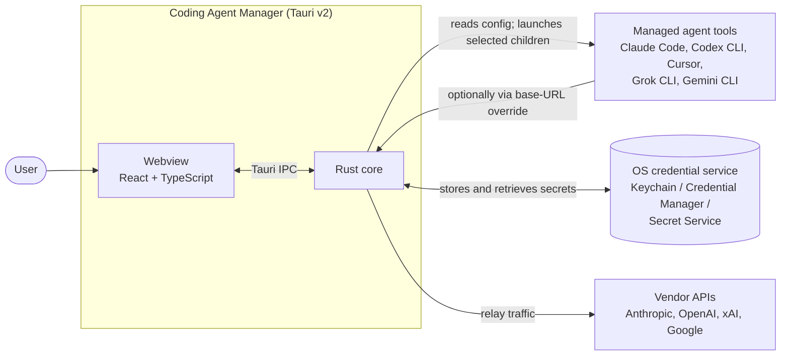
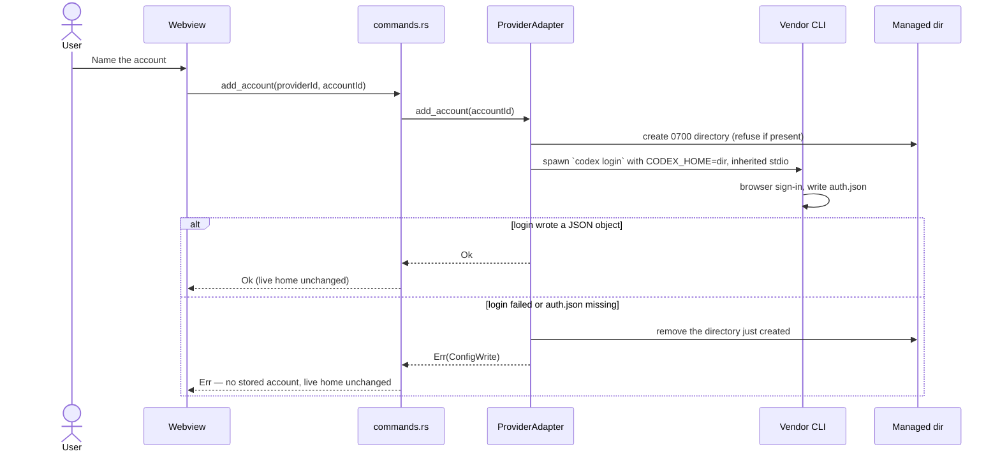
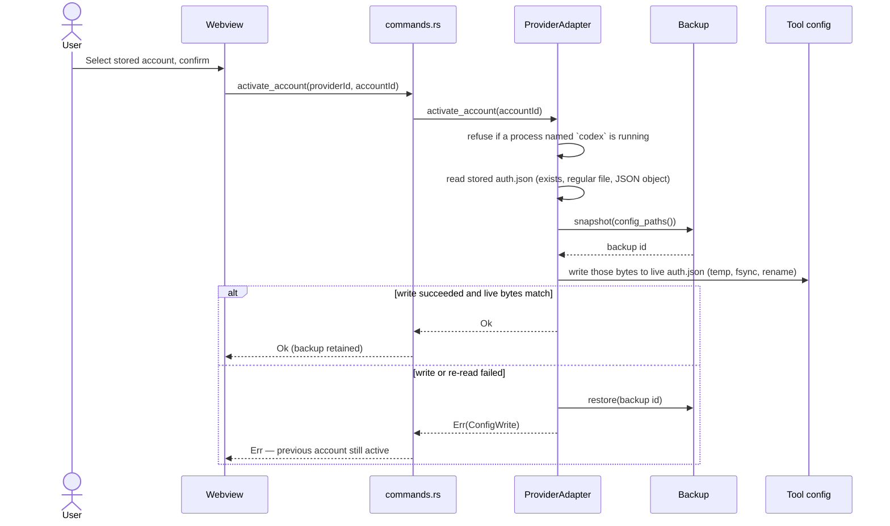

# Architecture

The proposed [MACO integration contract](MACO_INTEGRATION.md) defines a future
manual account authority shared by headless and desktop entry points. It is not
an implemented service; the sections below describe current behavior.

## 1. System context



Codex CLI replaces live `auth.json`. Claude Code rewrites the live `~/.claude`
identity fields. Both take a restorable backup first. Gemini and Grok
selection changes only an app-owned child launch environment. Vendor login
children may write isolated managed homes; the Rust core does not compose
their credential documents.

## 2. Process and thread model

| Component      | Runs as                                   | Responsibility                                           |
| -------------- | ----------------------------------------- | -------------------------------------------------------- |
| Tauri main     | Native process                            | Window lifecycle, IPC dispatch, plugin host.             |
| Rust core      | Same process, async tasks                 | Adapters, storage, launch selection, relay, router.      |
| Webview        | Platform WebView2 / WKWebView / WebKitGTK | Presentation only. Holds no secret and no business rule. |
| Relay listener | Async task, own port                      | HTTP ingress; started and stopped by the user.           |

There is no refresh scheduler. Current quota collection runs on demand, and
provider tools handle their own vendor sessions unless an implemented adapter
path states otherwise.

The webview never receives a secret. It receives masked identities and opaque
account ids, which is what makes `NFR-1` enforceable rather than aspirational.

## 3. Layering

```text
src-tauri/src/
  commands.rs   IPC surface           may depend on: everything below
  providers/    per-tool adapters     may depend on: storage, model, error
  storage/      secret persistence    may depend on: model, error
  relay/        protocol adaptation   may depend on: router, providers, storage, model, error
  router/       rule evaluation       may depend on: model, error
  model.rs      domain types          depends on: nothing
  error.rs      error taxonomy        depends on: nothing
```

Two rules make this enforceable in review:

1. **Only `commands.rs` may reference `tauri::`.** Everything below it compiles
   and tests without a webview, and stays reusable from the future headless
   binary that the Docker image needs (`FR-10`).
2. **No adapter may reference another adapter.** Cross-provider behaviour lives
   in core, never in a vendor-specific module.

## 4. The adapter contract

Every managed tool implements `ProviderAdapter`
(`src-tauri/src/providers/mod.rs`):

| Method                             | Contract                                                                                                                                                                         |
| ---------------------------------- | -------------------------------------------------------------------------------------------------------------------------------------------------------------------------------- |
| `id()`                             | Stable, kebab-case, never renamed — it appears in stored state.                                                                                                                  |
| `descriptor()`                     | Static facts plus live detection. Must not lie about maturity or `capabilities` (`NFR-8`).                                                                                       |
| `config_paths()`                   | Declared managed-tool configuration paths used by diagnostics and, where applicable, backup. App-owned account storage is not exhaustively represented here.                     |
| `detect()`                         | Cheap and side-effect free.                                                                                                                                                      |
| `list_accounts()`                  | Read-only. Returns masked identities and non-secret stored-account state only.                                                                                                   |
| `activation_mechanism()`           | Declares either a legacy tool-configuration switch or launch-environment selection.                                                                                              |
| `managed_account_plan()`           | Opts into the core-owned lifecycle and declares credential-store or retained-vendor-home material.                                                                               |
| `provision_stored_account()`       | Provisions a pending managed account. A credential value stays in native code; a vendor-home adapter returns no secret.                                                          |
| `launch_spec()`                    | Declares the executable, absolute working directory, and child-only environment for a complete selected account. It carries neither serialized secrets nor arbitrary IPC values. |
| `validate_stored_account_delete()` | Fails closed before deletion. Core deletes credential-store material; vendor homes are retained.                                                                                 |
| `add_account()`                    | Legacy adapter-owned creation. Default: `NotImplemented`.                                                                                                                        |
| `activate_account()`               | Legacy adapter-owned configuration switch. It must back up first (`NFR-4`). Launch-environment adapters leave this method unimplemented because core persists selection.         |
| `delete_account()`                 | Legacy adapter-owned deletion. Default: `NotImplemented`.                                                                                                                        |
| `quota()`                          | Returns an empty vector when the provider publishes no verified signal. Never fabricates a number.                                                                               |
| `plan_label()`                     | Optionally returns a non-secret plan label. It does not imply numeric quota data.                                                                                                |

`ProviderDescriptor.capabilities` is the list of operations the adapter will
honour: `add-account`, `switch-account`, `delete-account`, and `launch-tool`.
The Accounts page offers an action only when that list contains the matching
value. Maturity cannot serve this purpose. All current adapters are
experimental: Codex and Claude advertise `add-account`, `switch-account`, and
`delete-account`; Grok and Gemini also advertise `launch-tool`; Cursor
advertises none (`NFR-8`).

Legacy `add_account` and `delete_account` must not write the live tool home.
Legacy `activate_account` is the method that may replace a file the user's tool
owns, and it must snapshot first. For environment-selected adapters, core
persists selection and resolves a complete `LaunchSpec` again immediately
before spawning the child.

### Adding a sixth provider

1. Write `docs/research/<provider>.md` first, with confidence markers. An
   adapter written before the research is an adapter that will corrupt
   someone's login.
2. Add `src-tauri/src/providers/<provider>.rs` implementing the trait, with
   every path claim carrying its marker in a doc comment.
3. Add one line to `providers::registry()`.
4. Add contract-test fixtures under `src-tauri/tests/fixtures/<provider>/`
   (see [`TESTING.md`](TESTING.md)).
5. Advertise a capability only when the matching method is implemented.
6. Add a row to [`PROVIDER_MATRIX.md`](PROVIDER_MATRIX.md) and to the README
   table.

No core file changes. If a provider cannot be supported without changing core,
that is a signal the trait is wrong — widen the trait deliberately rather than
special-casing.

## 5. Account operations

There are two activation paths:

| Path               | Providers              | Effect                                                                                                                                                                  |
| ------------------ | ---------------------- | ----------------------------------------------------------------------------------------------------------------------------------------------------------------------- |
| Tool configuration | Codex CLI, Claude Code | Codex replaces live `auth.json`. Claude rewrites the live `~/.claude` identity pair. Both snapshot first. This affects those tools started outside the application too. |
| Launch environment | Grok, Gemini CLI       | Persists non-secret selection and applies it only to an app-owned child. It does not change the account used by tools started elsewhere.                                |

Cursor is read-only. Claude, Codex, Grok, and Gemini advertise `add-account`,
`switch-account`, and `delete-account`; Grok and Gemini also advertise
`launch-tool`.

### Managed-account layout

Non-secret managed-account metadata is stored atomically in versioned
`{data_dir}/stored-accounts.json`. Only a complete record can be selected or
launched. Pending and deleting records are recovery state, not usable accounts.

Vendor-written homes live under the application data directory, not under the
default tool home or the system temporary tree:

```text
{data_dir}/accounts/{provider_id}/{account_id}/
```

For Codex and Grok, the vendor CLI writes `auth.json` inside that layout.
Codex stored homes are governed by
[ADR 0008](adr/0008-vendor-written-auth-json-for-stored-codex-accounts.md).
Grok homes are retained under the narrower
[ADR 0009](adr/0009-launch-environment-account-selection.md) exception: the
application never copies, rewrites, backs up, or deletes them. Gemini API-key
material is held by `CredentialStore`. Gemini OAuth add writes an isolated
vendor home under the application data directory and does not swap live
`~/.gemini`. Tests inject temporary roots so fixtures never use live application
data.

### Adding a legacy Codex stored account



Stdio is inherited, so the CLI's prompts appear on the terminal that
launched this application. The child's output is never captured. The
command does not return until sign-in finishes or fails. Adding a stored
account does not switch the live home to it.

### Switching the legacy Codex configuration

Only Codex CLI implements this, and only for a stored copy. The document
being written is the vendor-issued `auth.json` from the managed directory.
This application does not retrieve a secret from the credential store and
does not compose credential JSON.



The backup is taken after the stored file has been loaded and before the
live home is touched, so a missing account cannot produce a snapshot, and
a write failure can still restore. Verification is a re-read of the live
file: the bytes must match what was written and must form a JSON object.
That check does not prove `codex login status` would report the expected
identity, and it does not prove the vendor accepts the copied credential
(`docs/research/codex-cli.md` §5).

`list_accounts` for Codex merges the live identity with every stored
copy whose `auth.json` is a JSON object. A stored account is marked
active only when its file is byte-identical to the live one. If one
matches, the live row is omitted rather than listed twice. If none
match, the live row is listed as active and not stored.

`config.toml` and every other live-home file are left untouched. They
belong to the machine, not the account.

### Selecting an account for launch

Core writes a pending metadata record before provisioning external material,
then marks it complete only after provisioning succeeds. Selection changes
only complete metadata. Immediately before launch, core revalidates the
provider/account binding and the adapter's `LaunchSpec`.

- Gemini managed API keys enter `CredentialStore` from native code and are
  resolved only at child spawn. The child receives `GEMINI_API_KEY`; conflicting
  auth selectors are removed. Add, select, launch preparation, and deletion do
  not modify the Gemini configuration tree.
- Grok provisioning runs vendor login in a derived managed home. Selection sets
  child-only `GROK_HOME` and removes inherited `GROK_AUTH_PATH`. Lock and session
  checks fail closed before provisioning, selection, launch, or forgetting.
  Forgetting removes metadata but retains all vendor-written files.

This launch path owns only children started through the application. An
external terminal does not consume the stored selection.

## 6. Relay and router

### Ingress and format detection

The relay exposes one port with several path prefixes, one per inbound dialect,
rather than sniffing bodies:

| Path prefix                              | Inbound format          |
| ---------------------------------------- | ----------------------- |
| `/v1/chat/completions`                   | OpenAI Chat Completions |
| `/v1/responses`                          | OpenAI Responses        |
| `/v1/images/generations`                 | OpenAI Images           |
| `/v1/messages`                           | Anthropic Messages      |
| `/v1beta/models/*:generateContent`       | Gemini                  |
| `/v1beta/models/*:streamGenerateContent` | Gemini streaming        |

Explicit paths mean a malformed body produces a clear 400 rather than being
silently misinterpreted as another vendor's schema.

### Translation

Text translation is a pure function with no I/O and covers all 12 ordered pairs
among OpenAI Chat Completions, OpenAI Responses, Anthropic Messages, and Gemini
GenerateContent. OpenAI Images and Gemini image requests and responses translate
in both directions. Anthropic image endpoints are explicit errors. This makes
the protocol layer golden-file testable (see [`TESTING.md`](TESTING.md)).

- **Message shape.** System prompt placement, role naming, and content-part
  arrays differ between all three dialects.
- **Streaming.** Supported cross-dialect streams translate event by event with
  bounded metadata state. Cross-dialect streaming requests sourced from OpenAI
  Responses and cross-dialect targets to OpenAI Responses are rejected because
  they require a completed accumulated snapshot. Gemini-target tool-call
  streams requiring partial argument assembly are rejected. After SSE headers
  have been sent, an event translation failure terminates the body as the
  generic transport error `relay stream event translation failed`; it cannot
  become a field-specific HTTP response.
- **Capability mismatch.** A field with no counterpart (a reasoning budget, an
  image size) is either mapped to the closest supported value or rejected with a
  clear error. It is never dropped silently.

The HTTP transport uses `storage::Secret` as the single secret representation
for listener and upstream authentication. The relay does not call
`CredentialStore`; runtime construction supplies any target secret. A
non-loopback listener is refused without a nonempty bearer token.

### Routing

Rules are evaluated in order with case-sensitive exact or one trailing-`*`
model match. A rule selects a provider and target model; the runtime must resolve
that provider to exactly one configured account target. A `max_utilization`
gate is ineligible when M4 data is missing, failed, malformed, or irrelevant.

Only HTTP 429 advances to the next matching rule. Translation, network, and
non-429 failures return immediately. The throttle deadline is the later usable
numeric `Retry-After` or M4 reset, or 60 seconds if neither is present. If no
rule matches, the request fails explicitly. Routed requests strip client
credential and account-selection headers, then inject only the selected target
authentication.

The ordered rule document is an atomic, versioned `route-rules.json`. Replacing
it does not change a running relay; the desktop loads it on the next start and
does not consult the legacy singleton target variables.

### Routed runtime target groups

Every provider id named by the persisted rules needs one runtime environment
group. `<KEY>` is the provider id uppercased with hyphens changed to
underscores.

| Variable                                              | Requirement | Constraint                                                                                                                                |
| ----------------------------------------------------- | ----------- | ----------------------------------------------------------------------------------------------------------------------------------------- |
| `CODING_AGENT_MANAGER_RELAY_TARGET_<KEY>_URL`         | Required    | Ends in `/`; contains no credentials, query, or fragment; HTTPS except loopback HTTP.                                                     |
| `CODING_AGENT_MANAGER_RELAY_TARGET_<KEY>_DIALECT`     | Required    | `openai-chat-completions`, `openai-responses`, `openai-images-generations`, `anthropic-messages`, or `gemini-generate-content`.           |
| `CODING_AGENT_MANAGER_RELAY_TARGET_<KEY>_ACCOUNT_ID`  | Required    | Nonempty account identity for this configured target.                                                                                     |
| `CODING_AGENT_MANAGER_RELAY_TARGET_<KEY>_AUTH_TOKEN`  | Optional    | Runtime-only upstream token.                                                                                                              |
| `CODING_AGENT_MANAGER_RELAY_TARGET_<KEY>_AUTH_HEADER` | Optional    | Requires `_AUTH_TOKEN`. Omitted or `authorization` means Bearer authentication; another allowed name receives the raw token as its value. |

A partial required group, an empty required value, or `_AUTH_HEADER` without
`_AUTH_TOKEN` fails startup. These environment groups are explicit runtime
targets, not integration with provider-selected managed accounts.

## 7. State and persistence

| Data                               | Location                                 | Class                                                                                                                                                           |
| ---------------------------------- | ---------------------------------------- | --------------------------------------------------------------------------------------------------------------------------------------------------------------- |
| Secrets this application stores    | OS credential service, or encrypted file | Secret. Never exported. Gemini API keys use this path.                                                                                                          |
| Stored-account metadata            | `{data_dir}/stored-accounts.json`        | Durable, non-secret, versioned. Contains pending, complete, and deleting lifecycle state, but no credential reference or value.                                 |
| Stored Codex `auth.json` copies    | `{data_dir}/accounts/codex-cli/{id}/`    | Secret on disk. Vendor-written and not encrypted here. See [ADR 0008](adr/0008-vendor-written-auth-json-for-stored-codex-accounts.md).                          |
| Retained Grok vendor homes         | `{data_dir}/accounts/grok-cli/{id}/`     | Secret on disk. Vendor-written, retained, and never copied, backed up, rewritten, or deleted. See [ADR 0009](adr/0009-launch-environment-account-selection.md). |
| Route rules                        | `{data_dir}/route-rules.json`            | Durable, non-secret, versioned ordered document.                                                                                                                |
| Quota snapshots                    | Not persisted                            | Collected on demand. No refresh scheduler or quota cache exists.                                                                                                |
| Backups of live tool configuration | Application data directory, timestamped  | Durable until pruned by retention. The implemented Codex switch retains its backup.                                                                             |

There is no generic migration engine. The encrypted credential envelope refuses
a newer schema version. Stored-account metadata and route rules require the
exact version they implement and refuse to overwrite malformed or unsupported
documents. Their writes use atomic replacement.

## 8. Concurrency and failure

| Situation                                  | Behaviour                                                                                                                                                                          |
| ------------------------------------------ | ---------------------------------------------------------------------------------------------------------------------------------------------------------------------------------- |
| Codex is running during a live-file switch | The adapter refuses if a process named `codex` is running or the process table cannot be read. Process-name detection is approximate.                                              |
| Grok managed home is busy or ambiguous     | Provisioning, selection, launch, and forgetting revalidate advisory locks and session records and fail closed. The vendor home is retained.                                        |
| Gemini auth selection conflicts            | Launch preparation checks the effective system-default, user, workspace, and system settings and refuses incompatible selectors. It applies environment changes only to the child. |
| Provider quota collection fails            | The Dashboard shows a failed state for that provider. Other provider rows remain visible. There is no cached snapshot fallback.                                                    |
| Managed configuration is unparsable        | An adapter refuses the operation instead of normalizing unknown data. The Codex write path restores its retained backup after a failed write or verification.                      |
| Credential store is unavailable            | The application refuses operations that require stored secrets. It never falls back to plaintext.                                                                                  |

## 9. Front-end structure

| Path                 | Role                                                                                                          |
| -------------------- | ------------------------------------------------------------------------------------------------------------- |
| `src/pages/`         | One component per route; no direct `invoke` calls except through `src/lib/tauri.ts`.                          |
| `src/lib/tauri.ts`   | The single typed boundary to Rust. Command names exist in exactly one place.                                  |
| `src/types/index.ts` | Mirrors `src-tauri/src/model.rs`. Changed together, always.                                                   |
| `src/components/`    | Presentational components. `NotImplemented` carries the `FR-*` id so unfinished surface area stays auditable. |
